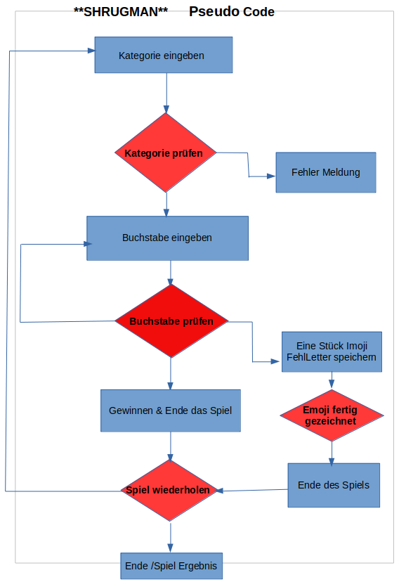

**SHRUGMAN**

**Spielablauf:**

Der Spieler sucht sich eine Kategorie (Filme oder Bücher) aus. Das Programm sucht sich einen Zufallstitel der ausgewählten Kategorie aus. Dann malt das Programm für jeden Buchstaben seines Wortes einen Strich. Nun versucht der Spieler das Wort zu erraten.

Der Spieler nennt nun in beliebiger Reihenfolge nacheinander einzelne Buchstaben des Alphabets. Das Programm muss nun jeweils ansagen, wie oft und an welcher Stelle des Lösungswortes der Buchstabe vorkommt. So ergibt sich nach und nach das gesuchte Wort. Kommt ein genannter Buchstabe darin jedoch nicht vor so beginnt das Programm damit, einEmoji (Galgen) zu zeichnen.

**Anleitung:**

1\. Zuerst wird der noch unbekannte Spieler begrüßt (und das fertige Emoji dabei angezeigt)

2\. Dieser wird daufhin aufgefordert seinen Namen im Terminal einzugeben (Klein- oder Großbuchstaben sollen bei der Eingabe keine Rolle spielen).

3\. Danach hat der Spieler die Chance zwischen zwei Kategorieen zu wählen die er ebenfalls durch die Eingabe des gewünschten Wertes im Terminal bestätigt.

4\. Das Programm generieert einen Zufallstitel aus der gewünschten Rubrik.

5\. Jetzt werden dem Spieler die Platzhalter des gesuchten Titels, über Unterstriche dargestellt, angezeigt.

6\. Nach der Eingabeaufforderung kann der Spieler einen Buchstaben eingeben (Klein- oder Großbuchstaben sollen bei der Eingabe keine Rolle spielen).

7\. Wenn der Spieler einen Buchstaben richtig errät, wird der Buchstabe anstelle des Unterstrichs an der richtigen Stelle angzeigt.

8\. Wählt der Spieler jedoch einen flaschen Buchstaben, wird dem Emoji ein Zeichen hinzugefügt und seine Fehlversuche werden angezeigt.

9\. 1

-**Errät der Spieler den verdeckten Titel bevor das Emoji fertig gezeichnet ist,** wird dem Spieler mitgeteilt, dass er gewonnen hat. Zusätzlich wird er gefragt, ob er noch einmal Spielen möchte.

Die Eingabe erfolgt wieder über das Terminal (Klein- oder Großbuchstaben sollen bei der Eingabe keine Rolle spielen).

9\. 1.2

Entscheidet sich der Spieler für eine neue Runde beginnt das Spiel bei 3.

9\. 1.3

Entscheidet der Spieler sich aber das Spiel abzubrechen, wird dem Spieler zum einen angezeigt, von wievielen Runden er wieviele Gewonnen oder Verloren hat sowie eine Verabschiedung.

9.2

-**Errät der Spieler das geheime Wort nicht****(Emoji ist fertig gezeichnet. Es gibt 10 Versuche)****,** wird dem Spieler mitgeteilt, dass er verloren hat und das gesuchte Wort wird angezeigt. Zusätzlich wird er gefragt, ob er noch einmal Spielen möchte. Die Eingabe erfolgt wieder über das Terminal (Klein- oder Großbuchstaben sollen bei der Eingabe keine Rolle spielen).

9.2.2

siehe: 9\. 1.2 - 9.1.3

**Extras:**

Halte das Terminal clean über: console.clear() und fülle das Programm mit Farbe mit: chalk.

## Examples

Take a look at the examples:

